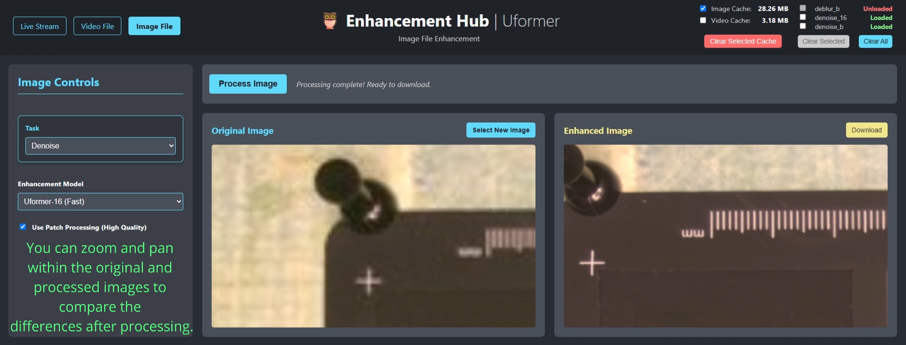

# Uformer Hub Service: A Production-Ready Image & Video Enhancement Service

<a href="https://www.youtube.com/watch?v=ncc1vPxfz48">
  
</a>

*Click the image above to watch the full video demonstration on YouTube ([Full Stack AI Project: A Production Uformer Service with FastAPI, Next.js & Docker](https://www.youtube.com/watch?v=ncc1vPxfz48)).*

**Uformer Hub Service** is a complete, containerized, and production-ready toolkit that serves state-of-the-art [Uformer models](https://github.com/ZhendongWang6/Uformer) for image and video restoration. It provides a robust FastAPI backend with a modern Next.js frontend, designed for developers and researchers who need a reliable, resource-aware, and easy-to-deploy solution for low-level vision tasks like denoising and deblurring.

This repository contains the necessary configuration files to run the entire application using pre-built Docker images from Docker Hub.

---

## Motivation

The official Uformer repository provides groundbreaking research code, but bridging the gap from research to a practical, usable tool presents several challenges:
*   **Dependency Rot:** The original environment relies on outdated dependencies, leading to significant setup friction and compatibility issues.
*   **Untested Pipeline:** The original code is not designed for easy testing or integration, making it difficult to verify results or add new models.
*   **Not a Service:** It is architected for academic evaluation, not for continuous, on-demand use as a web service.
*   **No Resource Management:** It lacks built-in mechanisms for managing GPU VRAM or disk cache, which is critical when serving multiple large models in a production environment.

This project solves these problems by re-engineering the Uformer pipeline into a robust, service-oriented architecture. We've modernized the dependencies, built a clean, test-friendly backend, and added professional-grade resource management features. The result is a turnkey solution that lets you go from clone to enhancement in minutes.

---

## Features

*   **⚡️ High-Performance FastAPI Backend:** A fully asynchronous backend capable of handling long-running image and video processing tasks without blocking.
*   **🖼️ Multi-Modal Enhancement:**
    *   **Image Processing:** Enhance individual images with support for patch-based processing for maximum quality.
    *   **Video Processing:** Asynchronously process entire video files, frame by frame.
    *   **Live Stream:** Real-time enhancement of webcam feeds via WebSockets.
*   **🧠 Multiple Uformer Models:**
    *   **Denoising (High Quality):** `Uformer-B` (584 MB) - The full-sized model for the best denoising results.
    *   **Denoising (Fast):** `Uformer-16` (61 MB) - A smaller, lighter model for faster processing, ideal for real-time applications.
    *   **Motion Deblurring:** `Uformer-B` (584 MB) - The full-sized model trained on the GoPro dataset for motion deblurring.
*   **🐳 Fully Containerized with Docker:** One-Command Deployment:** Run the entire stack with a single `docker-compose` command.
*   **🖥️ Modern Next.js Frontend:** A clean, responsive, and user-friendly interface for all features.
*   **✅ Advanced Resource Management:**
    *   **On-Demand VRAM Loading:** Models can be loaded into GPU memory on-demand to save resources, with UI controls to unload them.
    *   **Intelligent Cache System:** Automated and manual cache management to clean up temporary files, with protection for files in use.
*   **📖 Comprehensive API:** A fully documented API allows for easy integration into your own applications.

For more details on the architecture and API, please see the `documentation/` directory.

---

## Quick Start (Docker)

### Prerequisites
*   **NVIDIA GPU:** The backend service requires an NVIDIA GPU for PyTorch (CUDA) model inference.
*   **Docker:** Install [Docker](https://docs.docker.com/get-docker/) and [Docker Compose](https://docs.docker.com/compose/install/).
*   **NVIDIA Container Toolkit:** You must install the [NVIDIA Container Toolkit](https://docs.nvidia.com/datacenter/cloud-native/container-toolkit/latest/install-guide.html) to allow Docker to access the GPU.
*   **Note for macOS Users:** Due to the dependency on NVIDIA CUDA, the backend container cannot be run on macOS. The frontend can be run, but it will not be able to connect to a local backend.

### 1. Clone This Repository
```bash
git clone https://github.com/CaveMindLabs/uformer-hub-service.git
cd uformer-hub-service
```

### 2. Create Directories & Download Models

First, create all the necessary directories for models, logs, and temporary files with a single command:
```bash
mkdir -p backend/model_weights/official_pretrained backend/temp backend/debug_logs
```

These directories are mounted as volumes into the Docker containers.
```bash
uformer-hub-service/
└── backend/
    ├── model_weights/     # For storing the downloaded .pth model files
    ├── temp/              # For storing uploaded/processed images and videos
    └── debug_logs/        # For storing application logs
```

Next, download the following 3 `models` and place them inside the newly created `backend/model_weights/official_pretrained/` directory. Each model is optimized for a specific task based on its training data.

---
| Model / Task                  | File Size | Training Dataset & Best Use Case                                                                                                    | Download                                                                                                                              |
| ----------------------------- | --------- | ----------------------------------------------------------------------------------------------------------------------------------- | ------------------------------------------------------------------------------------------------------------------------------------- |
| **Denoising (High Quality)**  | 584 MB    | **[SIDD](https://mailustceducn-my.sharepoint.com/:f:/g/personal/zhendongwang_mail_ustc_edu_cn/EtcRYRDGWhBIlQa3EYBp4FYBao7ZZT2dPc5k1Qe-CdPh3A)** <br/> Best for general-purpose denoising of sRGB images from digital cameras. | [Uformer_B_SIDD.pth](https://mailustceducn-my.sharepoint.com/:u:/g/personal/zhendongwang_mail_ustc_edu_cn/Ea7hMP82A0xFlOKPlQnBJy0B9gVP-1MJL75mR4QKBMGc2w?e=iOz0zz) |
| **Denoising (Fast)**          | 61 MB     | **[SIDD](https://mailustceducn-my.sharepoint.com/:f:/g/personal/zhendongwang_mail_ustc_edu_cn/EtcRYRDGWhBIlQa3EYBp4FYBao7ZZT2dPc5k1Qe-CdPh3A)** <br/> A lighter version for faster performance, ideal for real-time use.      | [uformer16_denoising_sidd.pth](https://www.kaggle.com/datasets/ekojsalim/uformer-weights/data)                                       |
| **Motion Deblurring**         | 584 MB    | **[GoPro](https://mailustceducn-my.sharepoint.com/:f:/g/personal/zhendongwang_mail_ustc_edu_cn/EqKY3WMkbfVBlzldiEe4IEUBgr6BQx8mkI9jipWoWrwqQg?e=c5aPIe)** <br/> Best for correcting blur caused by camera shake or fast motion.    | [Uformer_B_GoPro.pth](https://mailustceducn-my.sharepoint.com/:u:/g/personal/zhendongwang_mail_ustc_edu_cn/EfCPoTSEKJRAshoE6EAC_3YB7oNkbLUX6AUgWSCwoJe0oA)      |

---
*__Note:__ Check the original `README.md`, [UFORMER_ORIGINAL_README.md](UFORMER_ORIGINAL_README.md)*, for more datasets

---
### 3. Configure Environment
Copy the example environment file. The default settings are configured for on-demand model loading.

```bash
cp backend/.env.example backend/.env
```

### 4. Run the Application
Use Docker Compose to build and start all services. Run from the root directory of the project where the `docker-compose.yml` file is located.

```bash
docker-compose up -d
```

The application is now running!
*   **Frontend UI:** [http://localhost:3000](http://localhost:3000)
*   **Backend API Docs:** [http://localhost:8000/docs](http://localhost:8000/docs)

---

## Application Usage

Once the application is running, navigate to [http://localhost:3000](http://localhost:3000).

*   **Live Stream:** Enhance your webcam feed in real-time. Select a `task` and model, then click "Start Webcam".
*   **Video File:** Upload a video file for enhancement. Processing is done in the background. You will be notified when it's complete.
*   **Image File:** Upload an image for enhancement. High-quality patch processing is enabled by default.

### Resource Management
The header contains controls for monitoring and managing server resources:
*   **Cache Manager:** View the disk space used by temporary image and video files and clear them. The system will protect files that are still being processed or viewed.
*   **VRAM Manager:** If on-demand loading is enabled (`LOAD_ALL_MODELS_ON_STARTUP=False` in `.env`), you can see which models are currently loaded in GPU VRAM and unload them to free up memory.

---

## Managing the Application

All commands should be run from the root directory of the project where the `docker-compose.yml` file is located.

*   **To Stop the Application:**
    The following command will stop and remove the containers and network. Your data in the `model_weights`, `temp`, and `debug_logs` folders will be preserved.
    ```bash
    docker-compose down
    ```

*   **To View Logs:**
    To see a live stream of logs from all services, use:
    ```bash
    docker-compose logs -f
    ```
    To view logs for a specific service (e.g., the backend), use:
    ```bash
    docker-compose logs -f backend
    ```
    To view logs for a another specific service (e.g., the frontend), use:
    ```bash
    docker-compose logs -f frontend
    ```
    Press `Ctrl+C` to stop viewing the logs.

*   **To Check Service Status:**
    To see the current status of the running containers:
    ```bash
    docker-compose ps
    ```

---

## License

This project is licensed under the MIT License. See the [LICENSE](LICENSE) file for details.

## Acknowledgements

This project would not be possible without the foundational work from the authors of Uformer.
*   **Original Paper:** [Uformer: A General U-Shaped Transformer for Image Restoration (CVPR 2022)](https://arxiv.org/abs/2106.03106)
*   **Original Codebase:** [github.com/ZhendongWang6/Uformer](https://github.com/ZhendongWang6/Uformer)
*   The original `README.md` from their repository is preserved [here (UFORMER_ORIGINAL_README.md)](UFORMER_ORIGINAL_README.md).
